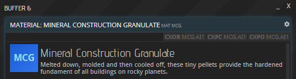

# Inline screens & Material shortcuts for Prosperous Universe

# Warning! Get new version here:

This repository is no longer maintained and Inline screens have been merged into PMMG Extended: https://sites.google.com/view/pmmgextended/home

Information below is outdated and installing from this repository will not work.

## Details

TamperMonkey script to improve UI of Prosperous Universe.

This script adds individual screens from the SCRNS dropdown to the top bar next to the **FULL** button.


It also adds three buttons to `MAT` buffers for easy access to exchanges: Order Book, Price Chart and Place Order. You can set your preferred exchange in the script's source code (see [Setting your preferred exchange](#setting-your-preferred-exchange)).



## Usage

Copy and paste contents of `addon.js` into a new TamperMonkey script and save, then reload the Prosperous Universe tab.

**Important:** You need to have BFRS turned ON in Apex (so you can see the NEW BFR button at the bottom), otherwise this script won't work.

## Adding exceptions to inline screens

If you don't want to expand all screens to the top bar, open the script in TamperMonkey and edit `const exceptions = ['finances'];`.
Write all exceptions in **lowercase**.

**Example:** All screens will be displayed at the top:

```js
const exceptions = [];
```

**Example:** All screens except 'Finances' and 'Base 2' will be displayed:

```js
const exceptions = ['finances', 'base 2'];
```

## Setting your preferred exchange

Open this script in Tampermonkey and replace the exchange code right at the top of the script.

**Example:** Set your exchange to IC1:

```js
const exchange = 'IC1';
```
